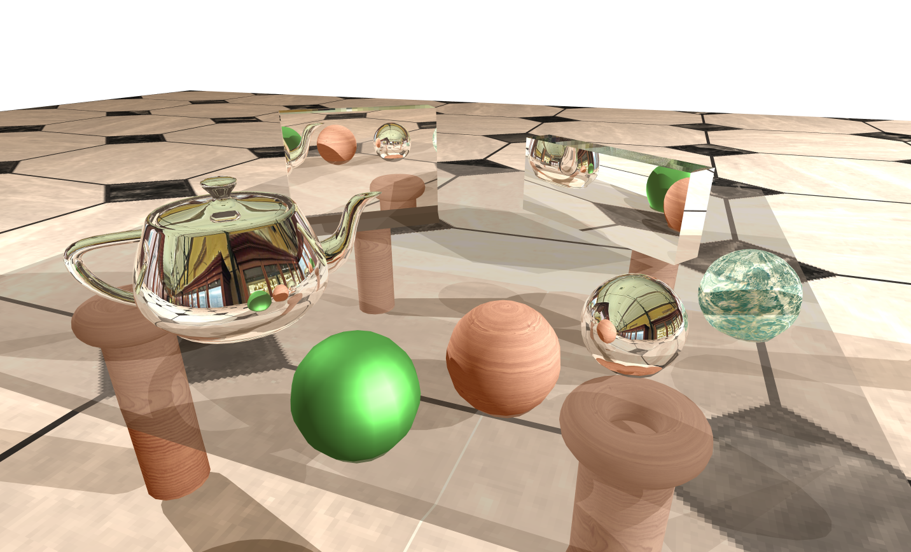

This is a school project. Goal was to implement different techniques to draw 3D objects.

# Rendered image

This image (1440x900) took 3h15 to render on an i7 at 3.8Ghz without concurrence. It used pretty much all the implemented effects.

- Raytracing
- Antialiasing 7
- Phong Shading
- 2D Mapping Texture
- Environment Map
- Specular Refraction
- Shadows

